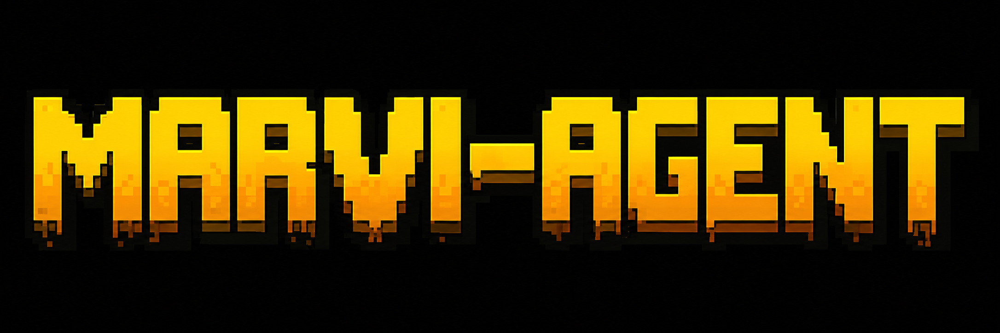

<p align="center">

  

</p>


# Marvi Agent ☤

<p align="center">

  <a href="https://github.com/xRetr00/Marvi">Marvi Agent</a> | <a href="https://github.com/xRetr00/Marvi/blob/main/website/docs/user-guide/desktop.md">Marvi Desktop</a>
</p>
<p align="center">
  <a href="https://github.com/xRetr00/Marvi/tree/main/website/docs"></a>
  <a href="https://github.com/xRetr00/Marvi"></a>
  <a href="https://github.com/xRetr00/Marvi/blob/main/LICENSE"></a>
  <a href="https://github.com/xRetr00/Marvi"></a>
  <a href="README.zh-CN.md"></a>

  <a href="README.ur-pk.md"></a>

</p>


**The self-improving AI agent built by [xRetro Labs Research](https://github.com/xRetr00/Marvi).** It's the only agent with a built-in learning loop — it creates skills from experience, improves them during use, nudges itself to persist knowledge, searches its own past conversations, and builds a deepening model of who you are across sessions. Run it on a $5 VPS, a GPU cluster, or serverless infrastructure that costs nearly nothing when idle. It's not tied to your laptop — talk to it from Telegram while it works on a cloud VM.

The legacy `hermes` command, `HERMES_*` env vars, and `~/.hermes` profile path remain supported for compatibility.


Use any model you want — [Nous Portal](https://portal.nousresearch.com), [OpenRouter](https://openrouter.ai) (200+ models), [NovitaAI](https://novita.ai) (AI-native cloud for Model API, Agent Sandbox, and GPU Cloud), [NVIDIA NIM](https://build.nvidia.com) (Nemotron), [Xiaomi MiMo](https://platform.xiaomimimo.com), [z.ai/GLM](https://z.ai), [Kimi/Moonshot](https://platform.moonshot.ai), [MiniMax](https://www.minimax.io), [Hugging Face](https://huggingface.co), OpenAI, or your own endpoint. Switch with `hermes model` — no code changes, no lock-in.


<table>

<tr><td><b>A real terminal interface</b></td><td>Full TUI with multiline editing, slash-command autocomplete, conversation history, interrupt-and-redirect, and streaming tool output.</td></tr>

<tr><td><b>Lives where you do</b></td><td>Telegram, Discord, Slack, WhatsApp, Signal, and CLI — all from a single gateway process. Voice memo transcription, cross-platform conversation continuity.</td></tr>

<tr><td><b>A closed learning loop</b></td><td>Agent-curated memory with periodic nudges. Autonomous skill creation after complex tasks. Skills self-improve during use. FTS5 session search with LLM summarization for cross-session recall. <a href="https://github.com/plastic-labs/honcho">Honcho</a> dialectic user modeling. Compatible with the <a href="https://agentskills.io">agentskills.io</a> open standard.</td></tr>

<tr><td><b>Scheduled automations</b></td><td>Built-in cron scheduler with delivery to any platform. Daily reports, nightly backups, weekly audits — all in natural language, running unattended.</td></tr>

<tr><td><b>Delegates and parallelizes</b></td><td>Spawn isolated subagents for parallel workstreams. Write Python scripts that call tools via RPC, collapsing multi-step pipelines into zero-context-cost turns.</td></tr>

<tr><td><b>Runs anywhere, not just your laptop</b></td><td>Six terminal backends — local, Docker, SSH, Singularity, Modal, and Daytona. Daytona and Modal offer serverless persistence — your agent's environment hibernates when idle and wakes on demand, costing nearly nothing between sessions. Run it on a $5 VPS or a GPU cluster.</td></tr>

<tr><td><b>Research-ready</b></td><td>Batch trajectory generation, trajectory compression for training the next generation of tool-calling models.</td></tr>

</table>


---


## Quick Install


### Linux, macOS, WSL2, Termux


```bash

curl -fsSL https://github.com/xRetr00/Marvi/blob/main/scripts/install.sh | bash

```


### Windows (native, PowerShell)


> **Heads up:** Native Windows runs Marvi without WSL — CLI, gateway, TUI, and tools all work natively. If you'd rather use WSL2, the Linux/macOS one-liner above works there too. Found a bug? Please [file issues](https://github.com/xRetr00/Marvi/issues).


Run this in PowerShell:


```powershell

iex (irm https://github.com/xRetr00/Marvi/blob/main/scripts/install.ps1)

```


The installer handles everything: uv, Python 3.11, Node.js, ripgrep, ffmpeg, **and a portable Git Bash** (MinGit, unpacked to `%LOCALAPPDATA%\hermes\git` — no admin required, completely isolated from any system Git install). Marvi uses this bundled Git Bash to run shell commands.


If you already have Git installed, the installer detects it and uses that instead. Otherwise a ~45MB MinGit download is all you need — it won't touch or interfere with any system Git.


> **Android / Termux:** The tested manual path is documented in the [Termux guide](website/docs/getting-started/termux.md). On Termux, Marvi installs a curated `.[termux]` extra because the full `.[all]` extra currently pulls Android-incompatible voice dependencies.
>

> **Windows:** Native Windows is fully supported — the PowerShell one-liner above installs everything. If you'd rather use WSL2, the Linux command works there too. Native Windows install lives under `%LOCALAPPDATA%\hermes`; WSL2 installs under `~/.hermes` as on Linux.


After installation:


```bash

source ~/.bashrc    # reload shell (or: source ~/.zshrc)

hermes              # start chatting!

```


---


## Getting Started


```bash

hermes              # Interactive CLI — start a conversation

hermes model        # Choose your LLM provider and model

hermes tools        # Configure which tools are enabled

hermes config set   # Set individual config values

hermes gateway      # Start the messaging gateway (Telegram, Discord, etc.)

hermes setup        # Run the full setup wizard (configures everything at once)

hermes claw migrate # Migrate from OpenClaw (if coming from OpenClaw)

hermes update       # Update to the latest version

hermes doctor       # Diagnose any issues

```


📖 **[Full documentation →](https://github.com/xRetr00/Marvi/tree/main/website/docs)**


---


## Skip the API-key collection — Nous Portal


Marvi works with whatever provider you want — that's not changing. But if you'd rather not collect five separate API keys for the model, web search, image generation, TTS, and a cloud browser, **[Nous Portal](https://portal.nousresearch.com)** covers all of them under one subscription:


- **300+ models** — pick any of them with `/model <name>`

- **Tool Gateway** — web search (Firecrawl), image generation (FAL), text-to-speech (OpenAI), cloud browser (Browser Use), all routed through your sub. No extra accounts.


One command from a fresh install:


```bash

hermes setup --portal

```


That logs you in via OAuth, sets Nous as your provider, and turns on the Tool Gateway. Check what's wired up any time with `hermes portal info`. Full details on the [Tool Gateway docs page](website/docs/user-guide/features/tool-gateway.md).


You can still bring your own keys per-tool whenever you want — the gateway is per-backend, not all-or-nothing.


---


## CLI vs Messaging Quick Reference


Marvi has two entry points: start the terminal UI with `hermes`, or run the gateway and talk to it from Telegram, Discord, Slack, WhatsApp, Signal, or Email. Once you're in a conversation, many slash commands are shared across both interfaces.


| Action                         | CLI                                           | Messaging platforms                                                              |

| ------------------------------ | --------------------------------------------- | -------------------------------------------------------------------------------- |

| Start chatting                 | `hermes`                                      | Run `hermes gateway setup` + `hermes gateway start`, then send the bot a message |

| Start fresh conversation       | `/new` or `/reset`                            | `/new` or `/reset`                                                               |

| Change model                   | `/model [provider:model]`                     | `/model [provider:model]`                                                        |

| Set a personality              | `/personality [name]`                         | `/personality [name]`                                                            |

| Retry or undo the last turn    | `/retry`, `/undo`                             | `/retry`, `/undo`                                                                |

| Compress context / check usage | `/compress`, `/usage`, `/insights [--days N]` | `/compress`, `/usage`, `/insights [days]`                                        |

| Browse skills                  | `/skills` or `/<skill-name>`                  | `/<skill-name>`                                                                  |

| Interrupt current work         | `Ctrl+C` or send a new message                | `/stop` or send a new message                                                    |

| Platform-specific status       | `/platforms`                                  | `/status`, `/sethome`                                                            |


For the full command lists, see the [CLI guide](website/docs/user-guide/cli.md) and the [Messaging Gateway guide](website/docs/user-guide/messaging/index.md).


---


## Documentation


All documentation lives in **[website/docs](https://github.com/xRetr00/Marvi/tree/main/website/docs)**:


| Section                                                                                             | What's Covered                                             |

| --------------------------------------------------------------------------------------------------- | ---------------------------------------------------------- |

| [Quickstart](website/docs/getting-started/quickstart.md)                 | Install → setup → first conversation in 2 minutes          |
| [CLI Usage](website/docs/user-guide/cli.md)                              | Commands, keybindings, personalities, sessions             |
| [Configuration](website/docs/user-guide/configuration.md)                | Config file, providers, models, all options                |
| [Messaging Gateway](website/docs/user-guide/messaging/index.md)                | Telegram, Discord, Slack, WhatsApp, Signal, Home Assistant |
| [Security](website/docs/user-guide/security.md)                          | Command approval, DM pairing, container isolation          |
| [Tools & Toolsets](website/docs/user-guide/features/tools.md)            | 40+ tools, toolset system, terminal backends               |
| [Skills System](website/docs/user-guide/features/skills.md)              | Procedural memory, Skills Hub, creating skills             |
| [Memory](website/docs/user-guide/features/memory.md)                     | Persistent memory, user profiles, best practices           |
| [MCP Integration](website/docs/user-guide/features/mcp.md)               | Connect any MCP server for extended capabilities           |
| [Cron Scheduling](website/docs/user-guide/features/cron.md)              | Scheduled tasks with platform delivery                     |
| [Context Files](website/docs/user-guide/features/context-files.md)       | Project context that shapes every conversation             |
| [Architecture](website/docs/developer-guide/architecture.md)             | Project structure, agent loop, key classes                 |
| [Contributing](website/docs/developer-guide/contributing.md)             | Development setup, PR process, code style                  |
| [CLI Reference](website/docs/reference/cli-commands.md)                  | All commands and flags                                     |
| [Environment Variables](website/docs/reference/environment-variables.md) | Complete env var reference                                 |


---


## Migrating from OpenClaw


If you're coming from OpenClaw, Marvi can automatically import your settings, memories, skills, and API keys.


**During first-time setup:** The setup wizard (`hermes setup`) automatically detects `~/.openclaw` and offers to migrate before configuration begins.


**Anytime after install:**


```bash

hermes claw migrate              # Interactive migration (full preset)

hermes claw migrate --dry-run    # Preview what would be migrated

hermes claw migrate --preset user-data   # Migrate without secrets

hermes claw migrate --overwrite  # Overwrite existing conflicts

```


What gets imported:


- **SOUL.md** — persona file

- **Memories** — MEMORY.md and USER.md entries

- **Skills** — user-created skills → `~/.hermes/skills/openclaw-imports/`

- **Command allowlist** — approval patterns

- **Messaging settings** — platform configs, allowed users, working directory

- **API keys** — allowlisted secrets (Telegram, OpenRouter, OpenAI, Anthropic, ElevenLabs)

- **TTS assets** — workspace audio files

- **Workspace instructions** — AGENTS.md (with `--workspace-target`)


See `hermes claw migrate --help` for all options, or use the `openclaw-migration` skill for an interactive agent-guided migration with dry-run previews.


---


## Contributing


We welcome contributions! See the [Contributing Guide](website/docs/developer-guide/contributing.md) for development setup, code style, and PR process.


Quick start for contributors — use the standard installer, then work from the
full git checkout it creates at `$HERMES_HOME/hermes-agent` (usually
`~/.hermes/hermes-agent`). This matches the layout used by `hermes update`, the
managed venv, lazy dependencies, gateway, and docs tooling.


```bash
curl -fsSL https://raw.githubusercontent.com/xRetr00/Marvi/main/scripts/install.sh | bash
cd "${HERMES_HOME:-$HOME/.hermes}/hermes-agent"
uv pip install -e ".[all,dev]"
scripts/run_tests.sh
```

Manual clone fallback (for throwaway clones/CI where you intentionally do not
want the managed install layout):


```bash

curl -LsSf https://astral.sh/uv/install.sh | sh

uv venv .venv --python 3.11

source .venv/bin/activate

uv pip install -e ".[all,dev]"

scripts/run_tests.sh

```


---


## Community


- 💬 [Discord](https://github.com/xRetr00/Marvi)

- 📚 [Skills Hub](https://agentskills.io)

- 🐛 [Issues](https://github.com/xRetr00/Marvi/issues)

- 🔌 [computer-use-linux](https://github.com/avifenesh/computer-use-linux) — Linux desktop-control MCP server for Marvi and other MCP hosts, with AT-SPI accessibility trees, Wayland/X11 input, screenshots, and compositor window targeting.

- 🔌 [HermesClaw](https://github.com/AaronWong1999/hermesclaw) — Community WeChat bridge: Run Marvi Agent and OpenClaw on the same WeChat account.


---


## License


MIT — see [LICENSE](LICENSE).


Built by [xRetro Labs Research](https://github.com/xRetr00/Marvi).
